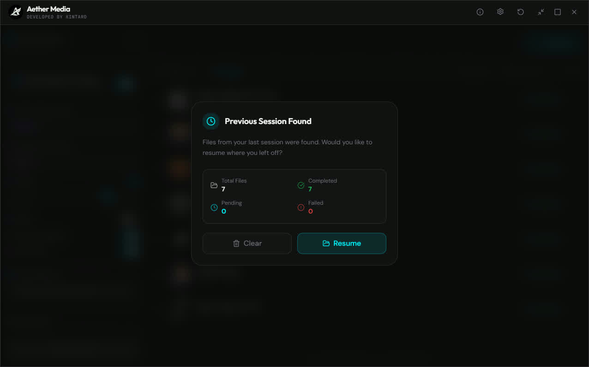

<div align="center">
  
  <br />
  <br />

  [](https://www.rust-lang.org/)
  [](https://tauri.app/)
  [](https://react.dev/)
  [](https://www.typescriptlang.org/)
  [](https://tailwindcss.com/)
  [](https://vitejs.dev/)
  [](https://www.gnu.org/licenses/gpl-3.0)

  <p align="center">
    <b>Modern, Fast and Powerful Media Conversion Tool</b>
    <br />
    <br />
    <a href="#features">Features</a> •
    <a href="#tech">Technologies</a> •
    <a href="#setup">Setup</a> •
    <a href="#license">License</a>
  </p>
</div>

---

## 📋 About

**Aether Media** is a next-generation desktop application that allows users to convert media files (video, audio, image) quickly, securely, and easily.

It is built on the performance of the **Rust** language and the lightweight nature of **Tauri v2**. Using the power of **FFmpeg** in the background, it presents complex media operations with a modern interface offering drag-and-drop simplicity. Your files are never uploaded to a server; all operations take place entirely locally on your own device.


## <a id="features"></a>✨ Features

### 🔄 Wide Format Support
Aether Media supports all popular media formats:
- **Video**: `MP4`, `MKV`, `MOV`, `WEBM`
- **Audio**: `MP3`, `AAC`, `M4A`, `OGG`
- **Image**: `JPG`, `PNG`, `WEBP`

### ⚡ Smart Conversion
- **Quality Control**: Precise quality adjustment between 0% and 100%. Offers the best size/quality balance with automatic **CRF (Constant Rate Factor)** calculation for video conversions.
- **Audio Extraction**: Ability to extract only the audio stream from video files and convert it to MP3, WAV, or AAC format.
- **Batch Processing**: Add multiple files to the queue simultaneously and process them sequentially.

### 🖼️ Advanced Resizing
Powerful resizing options for images and videos:
- **Fit**: Fits within the specified area while maintaining aspect ratio.
- **Cover**: Completely fills the area while maintaining aspect ratio (excess is cropped).
- **Stretch**: Stretches the image to fit the specified dimensions.
- **Background Color**: **Black**, **White**, or **Transparent** (for PNG/WebM) background option for gaps created during fitting operations.

### 🏷️ File Naming Management
Organizing your output files is now very easy:
- Add **Prefix**.
- Add **Date/Time** stamp.
- Unique naming with **Random** characters.
- Keep **Original** name.
- **Cleaning**: Automatically cleans invalid characters and spaces in file names.

### 🎨 Modern User Experience
- **Drag & Drop**: Drop files onto the application to start processing instantly.
- **Dark Mode**: Eye-friendly, stylish, and modern interface.
- **Progress Tracking**: Instant status, progress bar, and detailed error reporting for each file.
- **Per-File Overrides**: Customize conversion settings individually for each file in the queue.

### 🛡️ Secure & Smart Session Management
- **Session Restore**: Even if the application closes unexpectedly, your queued files and settings are not lost. You can continue from where you left off when you reopen the application.
- **Process Control**: Manage ongoing processes instantly with **Pause**, **Resume**, or **Cancel** options.

### ⚡ Batch Processing & Quick Access
- **Advanced Multi-Selection**: Manage files in bulk with Windows explorer-like `Ctrl + Click` and `Ctrl + A` shortcuts.
- **Error Management**: Re-queue or clear failed files with a single click.
- **Drag & Drop Zone**: Quickly add files by dragging them to an empty area or a special drop zone in the application.



## <a id="tech"></a>🛠️ Technologies

The project has been developed using the most up-to-date and performance-oriented technologies:

### Backend (Rust & Tauri)
- **[Tauri v2](https://v2.tauri.app/)**: Ultra-lightweight, secure framework providing access to native system features.
- **[Rust](https://www.rust-lang.org/)**: System programming language providing memory safety and high performance.
- **[Tokio](https://tokio.rs/)**: Non-blocking, smooth process management with asynchronous runtime.
- **[FFmpeg](https://ffmpeg.org/)**: Industry-standard media processing library (Integrated as Binary Sidecar).

### Frontend (React & TypeScript)
- **[React 19](https://react.dev/)**: Fast UI rendering with the newest React features.
- **[Vite](https://vitejs.dev/)**: Lightning-fast development and build tool.
- **[Tailwind CSS v4](https://tailwindcss.com/)**: Modern and flexible style definitions.
- **[Zustand](https://github.com/pmndrs/zustand)** + **[Immer](https://immerjs.github.io/immer/)**: Simple and powerful global state management with optimized immutable updates.
- **[Framer Motion](https://www.framer.com/motion/)**: Smooth animations and transitions.
- **[TanStack Virtual](https://tanstack.com/virtual)**: High-performance scrolling even in lists with thousands of files.
- **[Radix UI](https://www.radix-ui.com/)**: Accessible and customizable components.


## <a id="setup"></a>🚀 Setup and Development

Follow the steps below to run or develop the project in your local environment.

### Requirements
- **Node.js** (v18+)
- **Rust** (latest stable)
- **FFmpeg**: Must be placed under `src-tauri/binaries` within the project (see step 3).

### Step-by-Step Installation

1.  **Clone the Repo**
    ```bash
    git clone https://github.com/xkintaro/aether-media.git
    cd aether-media
    ```

2.  **Install Dependencies**
    ```bash
    npm install
    ```

3.  **FFmpeg Configuration**
    - Download a GPL-licensed `ffmpeg.exe` build for Windows (e.g. from [BtbN/FFmpeg-Builds](https://github.com/BtbN/FFmpeg-Builds)).
    - Save the file as `src-tauri/binaries/ffmpeg-x86_64-pc-windows-msvc.exe`.

4.  **Start the Application**
    ```bash
    npm run tauri dev
    ```

### Build

To create a distributable `.exe` installer for the application:

```bash
npm run tauri build
```
Output files will be created in the `src-tauri/target/release/bundle/nsis` directory.


## 📂 Project Structure

```
aether-media/
├── src/                        # Frontend (React + TypeScript)
│   ├── components/             # UI components
│   ├── hooks/                  # Custom React hooks
│   ├── lib/                    # Utilities, constants, animations
│   ├── store/                  # Zustand state management
│   └── types/                  # TypeScript type definitions
├── src-tauri/                  # Backend (Rust + Tauri)
│   ├── src/
│   │   ├── modules/
│   │   │   ├── ffmpeg.rs       # FFmpeg command builder
│   │   │   ├── naming.rs       # File naming logic
│   │   │   └── thumbnail.rs    # Thumbnail generation
│   │   ├── commands.rs         # Tauri command handlers
│   │   ├── error.rs            # Custom error types
│   │   ├── state.rs            # Application state
│   │   └── types.rs            # Shared data structures
│   ├── binaries/               # FFmpeg binary (not included in repo)
│   └── tauri.conf.json         # Tauri configuration
└── public/                     # Static assets
```

## <a id="license"></a>📄 License

This project is licensed under the **GNU General Public License v3.0** — see the [LICENSE](LICENSE) file for details.

This project bundles **FFmpeg**, which is also distributed under the GPL v3. For more information, visit [ffmpeg.org/legal.html](https://ffmpeg.org/legal.html).

---

<p align="center">
  <sub>❤️ 2026 Aether Media. Developed by Kintaro.</sub>
</p>