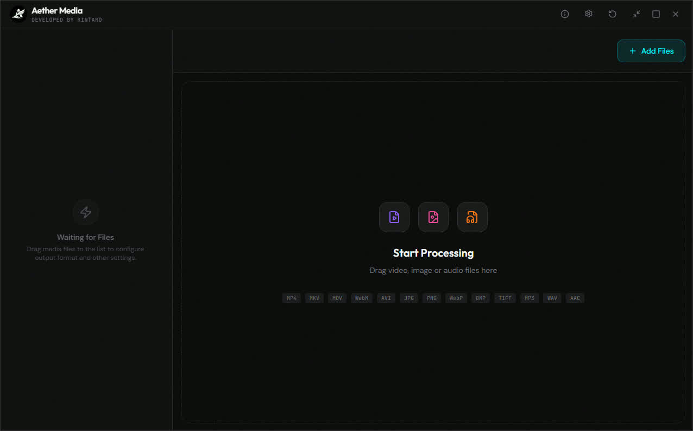
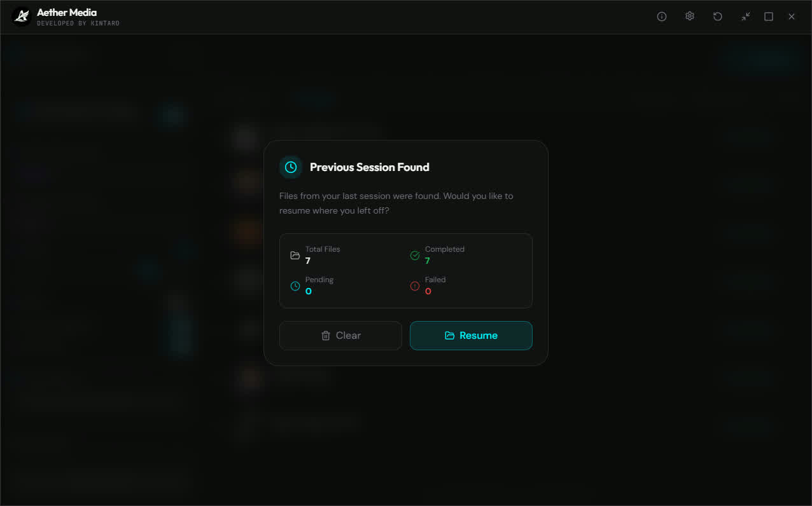

<a href="README.md">
  
</a>

<a href="README-TR.md">
  
</a>

  <br />
  <br />

<div align="center">
  

  <br />
  <br />

  <p>
    Modern, Fast, and Powerful Batch Media Processing Tool
  </p>


  <p>
    <a href="#features">Features</a> •
    <a href="#tech">Tech Stack</a> •
    <a href="#installation">Installation</a> •
    <a href="#project-structure">Project Structure</a> •
    <a href="#license">License</a> •
    <a href="#gallery">Gallery</a>
  </p>

  <br />
  <br />
</div>


## ⚠️ WARNING

> I wrote this documentation for version 1.0.0 of the project. I have changed the quality adjustment logic, fixed many bugs, and added many useful new features. However, I haven't had time to write new documentation yet. Actually, there isn't much technical information or critical instructions in the documentation that you would desperately need anyway. You can easily understand how it works as soon as you run the program.
>
> Date this Warning was Written: May 08, 2026 

## 📋 About

**Aether Media** is a media processing tool that allows users to batch convert, compress, resize, and rename media files (video, audio, image) quickly, securely, and easily.

Built on the performance of **Rust** and the lightweight nature of **Tauri**. Using the power of **FFmpeg** in the background, it offers complex media operations with a modern interface. Your files are never uploaded to a server; all processes take place entirely locally on your own device.



## ✨ Features <a id="features"></a>

### Wide Format Support
Aether Media supports all popular media formats:
- **Video**: `MP4`, `MKV`, `MOV`, `WEBM`
- **Audio**: `MP3`, `AAC`, `M4A`, `OGG`
- **Image**: `JPG`, `PNG`, `WEBP`

### Smart Conversion
- **Quality Control**: Precise quality adjustment between 0% and 100%. Offers the best size/quality balance for video conversions with automatic **CRF (Constant Rate Factor)** calculation.
- **Audio Extraction**: Ability to extract only the audio stream from video files and convert it to MP3, WAV, or AAC formats.
- **Batch Processing**: Adding multiple files to the queue at once and processing them sequentially.

### Advanced Resizing
Powerful resizing options for images and videos:
- **Fit**: Fits into the specified area while maintaining aspect ratio.
- **Cover**: Completely fills the area while maintaining aspect ratio (excess parts are cropped).
- **Stretch**: Stretches the image to fit the specified dimensions.
- **Background Color**: **Black**, **White**, or **Transparent** (for PNG/WebM) background options for gaps created during fitting operations.

### File Naming Management
Organizing your output files is now very easy:
- Adding **Prefix**.
- Adding **Date/Time** stamp.
- Unique naming with **Random** characters.
- **Preserving original** name.
- **Cleaning**: Automatically cleans invalid characters and spaces in file names if desired.

### Modern User Experience
- **Drag & Drop**: Start processing instantly by dropping files onto the application.
- **Dark Mode**: Eye-friendly, stylish, and modern interface.
- **Progress Tracking**: Instant status for each file, progress bar, and detailed error reporting.
- **Per-file Settings**: Individually customize conversion settings for each file in the queue.

### Secure and Smart Session Management
- **Session Recovery**: Even if the application closes unexpectedly, your files in the queue and your settings are not lost. You can continue where you left off when you reopen the application.
- **Process Control**: Instantly manage ongoing processes with **Pause**, **Resume**, or **Cancel** options.

### Batch Processing and Quick Access
- **Advanced Multi-Selection**: Manage files in batch with Windows Explorer-like `Ctrl + Click` and `Ctrl + A` shortcuts.
- **Error Management**: Re-queue or clear failed files with a single click.
- **Drag & Drop Zone**: Quickly add files by dragging them to an empty space within the application or the special drop zone.

## <a id="tech"></a>🛠️ Technologies

The project has been developed using the most up-to-date and performance-oriented technologies:

### Backend (Rust & Tauri)
- **Tauri**: Ultra-lightweight and secure framework providing access to native system features.
- **Rust**: Systems programming language offering memory safety and high performance.
- **Tokio**: Non-blocking, fluid process management with an asynchronous runtime.
- **FFmpeg**: Industry-standard media processing library.

### Frontend (React & TypeScript)
- **React 19**: Rapid UI creation with the latest React features.
- **Vite**: Lightning-fast development and build tool.
- **Tailwind CSS**: Modern and flexible style definitions.
- **Zustand + Immer**: Simple and powerful global state management with optimized immutable updates.
- **Framer Motion**: Fluid animations and transitions.
- **TanStack Virtual**: High-performance scrolling even in lists of thousands of files.
- **Radix UI**: Accessible and customizable components.

## 🚀 Installation <a id="installation"></a>

Follow the steps below to run or develop the project in your local environment.

### Requirements
- **Node.js** (v18+)
- **Rust** (latest stable version)
- **FFmpeg**: Must be placed under `src-tauri/binaries` within the project (see step 3).

### Step-by-Step Installation

1.  **Clone the Repository**
    ```bash
    git clone https://github.com/xkintaro/aether-media.git
    cd aether-media
    ```

2.  **Install Dependencies**
    ```bash
    npm install
    ```

3.  **FFmpeg Configuration**
    - Download a GPL-licensed version of `ffmpeg.exe` for Windows (e.g., [BtbN/FFmpeg-Builds](https://github.com/BtbN/FFmpeg-Builds)).
    - Save the file as `src-tauri/binaries/ffmpeg-x86_64-pc-windows-msvc.exe`.

4.  **Start the Application**
    ```bash
    npm run tauri dev
    ```

### Build

To create a distributable `.exe` installer for the application:

```bash
npm run tauri build
```
Output files will be created in the `src-tauri/target/release/bundle/nsis` directory.

## 📂 Project Structure <a id="project-structure"></a>

```
aether-media/
├── src/                        # Frontend (React + TypeScript)
│   ├── components/
│   ├── hooks/
│   ├── lib/
│   ├── store/
│   └── types/
├── src-tauri/                  # Backend (Rust + Tauri)
│   ├── src/
│   │   ├── modules/
│   │   │   ├── ffmpeg.rs       # FFmpeg command generator
│   │   │   ├── naming.rs       # File naming logic
│   │   │   └── thumbnail.rs    # Thumbnail generation
│   │   ├── commands.rs
│   │   ├── error.rs
│   │   ├── state.rs
│   │   └── types.rs
│   ├── binaries/               # FFmpeg binary (not included in the repo)
│   └── tauri.conf.json
└── public/
```

## <a id="license"></a>📄 License

This project is licensed under the **GNU General Public License v3.0**. See the [LICENSE](LICENSE) file for details.

This project includes **FFmpeg**, which is also distributed under GPL v3. For more information, visit [ffmpeg.org/legal.html](https://ffmpeg.org/legal.html).

## 🖼️ Gallery <a id="gallery"></a>



#


#


#

<p align="center">
  <sub>❤️ Developed by "Mustafa TAŞAL" (kintaro)</sub>
</p>